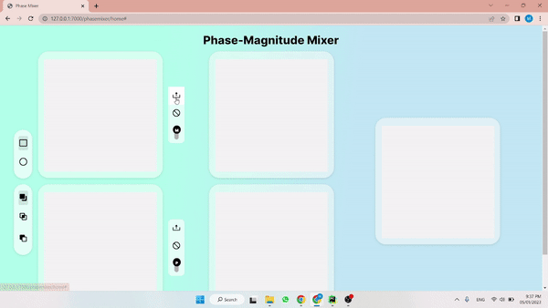
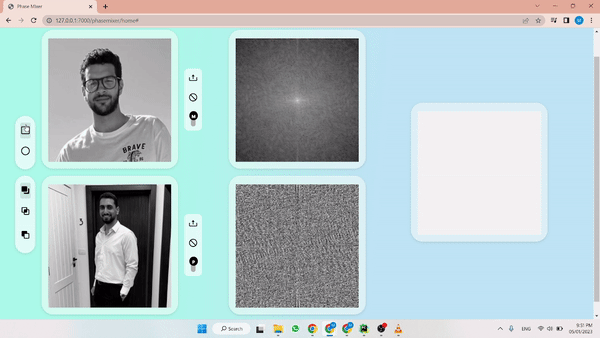
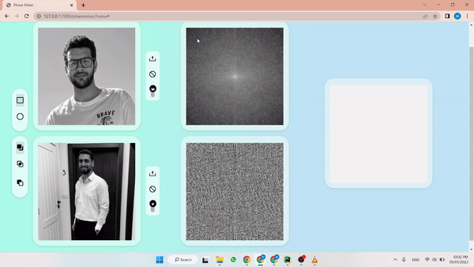
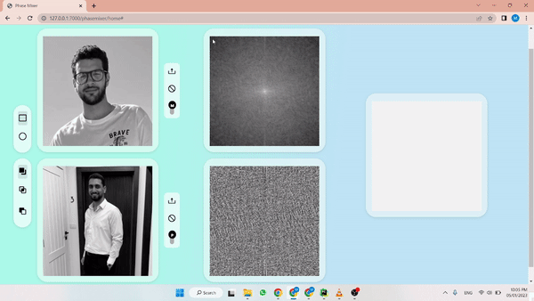
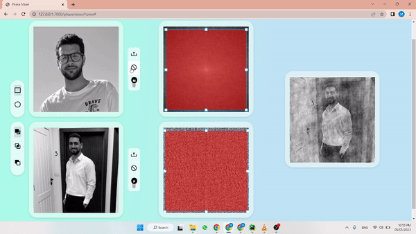

# Phase-Magnitude Mixer - Digital Signal Processing Task 4

## Table of contents:
- [Introduction](#introduction)
- [Project Features](#project-features)
- [Project Structure](#project-structure)
- [Quick Preview](#quick-preview)
- [How to Run The Project](#run-the-project)
- [Team]()


### Introduction
Phase and magnitude is the two basic components for any signal. One of these signals are images. In this project,
we are going to mix two images with different phase and magnitude. The main idea is to mix the phase of one image with
the magnitude of another image and vise versa to show that phase has the most details of the image, and it's more important
and magnitude has the intensity of the image, and it's less important. 
The result of the mixing is a new image that has almost the details of the first image and the intensity of the second image.
so it's a new image that is close to the first image.

### Project Features
In this project you can:
- [x] Mix 2 images' phases and magnitudes.
- [x] Add image phase to uniform magnitude.
- [x] Add image magnitude to uniform phase.
- [x] drag shapes over the image to select the phase/magnitude part you want.
- [x] apply low pass & high pass filters to the image's phase/magnitude.
- [x] draw multiple shapes to select multiple parts of the image.
- [x] selection modes:
  - select all shapes over image.
  - select the intersection between shapes over image.
  - select the difference between shapes over image.


### Project Structure
The Web Application is built using:
- Frontend:
  - HTML
  - CSS
  - JavaScript
  - BootStrap
  - Konva.js
  - jQuery
  - Axios
- Backend framework:
  - Django (Python)

The Frontend main function to set the structure of the page and let the user interact with the page through
viewing images, selecting shapes, and applying filters. and send the data to the backend to process the data and then
return the processed image to the frontend to display it to the user. We use Axios and fetch to send asynchronous requests
to the server. The Backend main function is to process the images, data and apply fast fourier transform to the images,
extract the phase and magnitude of the images, and apply masks to the images.

```
master
├─  Phasemixer
│  ├─  nootbooks 
│  ├─  static (js, css & images)
│  ├─  templates (HTML)
│  ├─  urls.py (application routing)
│  ├─  views.py (application endpoints)
│  ├─  utils.py (helper functions)
│  └─  image.py (Image Class)
├─  server
├─  manage.py (server manager)
├─  README.md
└─  requirements.txt
```

### Quick Preview

#### Upload Images & Toggle between their phases and magnitudes

#### Drag Multiple Shapes to select multiple parts of the image

#### Low Pass Filter

#### High Pass Filter

#### Selecting modes

#### Uniform Phase & Magnitude


### Run the Project 
1. Install Python3 in your computer
``` 
Download it from www.python.org/downloads/
```
2. Install the required packages
```
pip install -r requirments.txt
```
3. Run the Backend Server
```shell
python manage.py runserver 7000
```
visit http://localhost/phasemixer/home

### Team

First Semester - Biomedical Digital Signal Processing (SBE3110) class project created by:

| Team Members' Names                                  | Section | B.N. |
|------------------------------------------------------|:-------:|:----:|
| [Ibrahim Mohamed](https://github.com/1brahimmohamed) |    1    |  2   |
| [Mahmoud Yaser](https://github.com/mahmoud1yaser)    |    2    |  30  |
| [Maye Khaled](https://github.com/mayekhaled0)        |    2    |  40  |
| [Mariam Wael](https://github.com/MariamWaell)        |    2    |  36  |

### Submitted to:
- Dr. Tamer Basha & Eng. Abdallah Darwish
All rights reserved © 2022 to Team 12 - Systems & Biomedical Engineering, Cairo University (Class 2024)